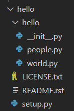

# Create my own Python Module

These are my notes while learning to create my own python module. I have copied some of the reference and code verbatim to make it easier for me to read. Please refer to the reference for a more detailed explanation.

### References

- [How to create Python Modules, the complete tutorial](https://www.ictshore.com/python/create-python-modules-tutorial/)

### Create a module named **Hello**

- Hello file structure
  > 
- \_\_init\_\_.py
  ```
  __version__ = '0.1.0'
  ```
- people.py

  ```
  def say_hello(people):
        for person in people:
            print("Hello, " + person + "!")
  ```

- world.py

  ```
  class World:
  def **init**(self, world_name):
  self.name = world_name

        def hello(self):
            print("Hello, " + self.name + "!")
  ```

- setup.py
  ```
  from setuptools import setup
  setup(name='hello',
        version='0.1',
        description='A plugin to say hello in several ways',
        url='http://ictshore.com/',
        author='Your Name',
        author_email='your.name@example.com',
        license='MIT',
        packages=['hello'],
        zip_safe=False)
  ```
- LICENSE.txt and README.rst are empty files

### Install **hello**

- From terminal enter:
  ```
  >python -m pip install -e <full path to the hello folder>
  (e.g. >python -m pip install -e C:\Users\...\hello)
  ```
  - -m flag uses the current activated version of python
  - \-e flag is a symlink, change in the source code is immediately available in the module
- After installation, file **hello.egg-link** is placed in the python\site-packages directory
  - (e.g. C:\Users\\....\\python 3.7.9\Lib\site-packages\\hello.egg-link)
- Content of **hello.egg-link** is the full path to folder **hello** and a period(.)

  ```
  C:\Users\...\hello
  .
  ```

- Folder hello.egg-info is placed in the main **hello** folder

### Test it by running these code

```
'''An example file that imports some of the installed modules'''
import sys
from platform import python_version
import hello as ho
from hello import people, world

print("python_path:    ", sys.executable)
print("python_version: ", python_version())
print("hello_version:  ", ho.__version__)
if __name__ == "__main__":
    # If the modules can't be imported, the following print won't happen
    print("Successfully imported the modules!", "\n")

people.say_hello(['Trevor', 'Elias'])
world.World('World').hello()
```

- Change the last line of world.py and re-run the above code
  ```
  print("Hello, " + self.name + "!" + " Wow, I made my first module!")
  ```

### To uninstall

```
>python -m pip uninstall hello
```

- Or delete file in python ...\\lib\site-packages\\hello.egg-link
